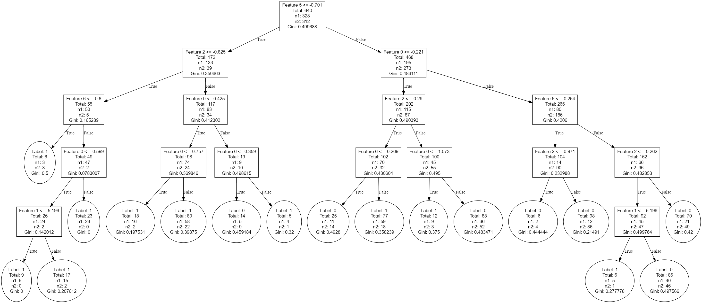

# Binary Decision Tree Implementation and Usage

## Overview
This program demonstrates the workflow of using a custom implementation of a Binary Decision Tree for classification purposes. It includes functionalities such as loading a dataset from a CSV file, training the model, evaluating its accuracy, and visualizing the trained tree structure.

## Dataset Description
The dataset, "Diagnosis_7features.csv", contains 640 entries and 8 columns. Each entry represents a medical diagnosis record with 7 features, and each feature is a floating-point number. The last column is an integer representing the class label with a binary value indicating the outcome of the diagnosis.

### Features
- `p_bmi`: The patient's BMI (Body Mass Index).
- `personal_Hypertension`: Indicates if the patient has a history of hypertension.
- `personal_Hypertension_Year`: The number of years since the patient was diagnosed with hypertension.
- `personal_CHF`: Indicates if the patient has a history of congestive heart failure.
- `personal_PepticUlcer`: Indicates if the patient has a history of peptic ulcer disease.
- `SBP_pre`: The systolic blood pressure measurement taken prior to the diagnosis.
- `eGFR_pre`: The estimated glomerular filtration rate before diagnosis.

### Label
- `class`: The label indicating the diagnosis outcome (1 for positive, 0 for negative).

### First Few Entries
The first few entries of the dataset are as follows:
|   p_bmi |   personal_Hypertension |   personal_Hypertension_Year |   personal_CHF |   personal_PepticUlcer |   SBP_pre |   eGFR_pre |   class |
|--------:|------------------------:|-----------------------------:|---------------:|-----------------------:|----------:|-----------:|--------:|
|   0.722 |                   0.192 |                       -0.957 |         -0.106 |                 10.404 |    -0.609 |      0.652 |       1 |
|  -1.518 |                   0.192 |                       -0.957 |         -0.106 |                 -0.096 |    -1.07  |      1.047 |       1 |
|  -1.07  |                   0.192 |                       -0.54  |         -0.106 |                 -0.096 |    -1.809 |      0.215 |       1 |
|  -0.648 |                   0.192 |                       -0.123 |         -0.106 |                 10.404 |     0.592 |     -0.536 |       1 |
|  -0.666 |                   0.192 |                       -0.123 |         -0.106 |                 -0.096 |    -0.516 |     -0.085 |       1 |

## Key Features
- **Data Loading**: Load your dataset from a CSV file named "Diagnosis_7features.csv".
- **Model Training**: Train a decision tree model using the loaded dataset.
- **Accuracy Evaluation**: Calculate and display the accuracy of the trained model.
- **Tree Visualization**: Generate a DOT file to visualize the tree structure using Graphviz.

## Usage
1. Ensure the dataset file "Diagnosis_7features.csv" is located in the same directory as the executable.
2. Compile and run the program. It will display the loaded data, the model's accuracy, and generate a "tree.dot" file.
3. Optionally, use Graphviz to convert the "tree.dot" file into a graphical representation of the decision tree, or use an online Graphviz tool such as [GraphvizOnline](https://dreampuf.github.io/GraphvizOnline/?compressed=CYSw5gTghgDgFgAgCoQKaoQbwLACgEEIB2A9sBgNoBmJRALkVALaoC8ARABKoA2AbqjogAxlHYBdANx5CCAAwIKPKACNeHAGKoodAK5oEAVgQAeVggC0cgHQB2OQEYAOkSQk6UHgC4EANgAsci5EDj4AzABMABzBEeEOES4A4iBEID42-gCcWb5RUewANAgAznCwbCokAB5SMoQKFgB8CA6Kymo8HCi6qBLS%2BIRtSqrq7Fo6%2BhgRpuZW1lERhi5uHt6ttolEIT4OYWGx4VnJqeny1mGGcr6%2BYUWl5TCVNXWDBG3NCDMjnd0Qvf16gRvh0xhM9AZfLNLDZfCt3J4fIZlttQkYgts4kYTmkMtYHL5DNEsvcyhVWFVagNZDNPmF2qMuuwen1XrJ6T8xgAZRm7eFrHxw1HhQ4IA5EFK486GUmPNi8HggGAlVBswi0lr%2BBm-caeFWAt4ILWcpngqbyaHzQw5fmIo3HYVG2yiraSs42OS2KJhOSe2Xkylqghaz7GE1-AFBozasHaCEYNpmSyGfG5W3rCJCnZffwunHu-H%2BCKOCL%2Bp4Ul7UwjGT5Q8PM-6sqsEOugpk8zp81wI9YO7N9rEYt0ZMvyniK5Wq5vRz62GOmvVNoEIOf1ju8LurO0OZ2OhwoohY12nPHF2y%2BBKj1gKpUqqMhlpReeaRcG2RPte81rpnwRcXZv9RSHE95CvG9JyjD4WiyZ9dR4fUoxg%2BszQMBQk0yJYf1aHdgjRb1RTCXMJRAzIEh9UtijJctA2nGDPgcBR6xZN8hkYttNDjc0oSTeZbEMXct17GJHVsIjD1-Ijh3OMJfCyKJ-F8K8aOXBjLBaBxhnYhtI2nDTYPXdZnG7AVWmE7MCTzYipRsBwsj4sIHDA8dbynFTGnUkFGRfeCl0NBJ9K-IzBJ8KIMWzQwzKPY9rIuOS%2BKcic71otTWg5LSNFfSC0q88ZOMhaEbEuB1gtaPs0QHXZgJi7IogvGVKLlCsqRU%2Bl6ONLTmMg9qcoMjIsIcMS0QPLEHSkzJrQceSEpcrKUv3WCMp8lj3jDLTeu-Yy7QPNExKxIyxouCiHnJcCkuXdzWlbHLFoQ3Srp1FCMDQuYbAiCIgp7HwFLMtFbOG39bHFA7-FqjTHIagNKxUqF6NXDrG2WjYFry6ZLVe4rPq%2BOQtnM-dRSiXdgayOQwiyO4IeoqG-LneiP3hnSVLp66Ub8NHrEzDGTIYnG0XsAjooLfwfV8OR-CUqnZEmuakPp3zJZlnqvwxErML3IzxNaSSSOsbJommiDdKfT5iwWzLpxNz9Ow2krbF3cKKtM-M8UuRZSf1s7qZS97TaWqNveQlnuLmBxrE9cUSoYsKdv%2BowUSJ%2Brjsp5rDW943PJ1TrzfT7lAv6nmfAdoHtbCeKKbHRLXJTqCvmyh6zeXP8Aqt5XMfyXDwizLEiSd84QcI2xwcT8uZrur3urr33zfH2NJnynjXoCLDMyzPCwr22qe4w65xeTmkHy%2BVacszhvD4elmZnn6w7I%2BrnRfbzXRWJzf2ciOSCjLpq-ZrFpM1g4%2BU-ujnZuWEV6-lFFraq-goFQPdpXGk38vhw2uvXFOSCdTrRbiZOS98Ej4yFAdd62RB5UWHgbBu%2B9og%2B1ug3JmZ9Z6o0vpmLYEdfD5z8J3Au%2BDtYg2iIYcmQ9P7myNj-BWGcEZ%2B1ETPeMrRLQplskKEqWQ2H%2BBjv4Qm3CcjnjFh-ZSKc6ItB9H-cR05DGWw3NbTGoDsSYi7AQ22tt34CNOnA9U%2BixSaWQZPZcDkm7mMwXaDejpAjgK4dVOyhgbiwL9sIsU2cFxeMNJEXx6x-HrD5o6d64DRrcKOiQ68zkyG4AAL54CAA).

## Model Accuracy
The accuracy of the trained Binary Decision Tree model is 0.720313.

## Tree Structure Visualization
Below is the visualized structure of the trained Binary Decision Tree.

## Requirements
- A C++ compiler supporting C++11 or later.
- A dataset in a CSV file named "Diagnosis_7features.csv".
- Graphviz installed (optional) for generating a visual representation of the decision tree, or use an online Graphviz tool such as [GraphvizOnline](https://dreampuf.github.io/GraphvizOnline).

## License
Copyright (c) 2024 by Chen-Yu Chang

